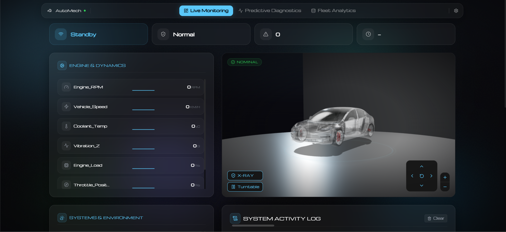
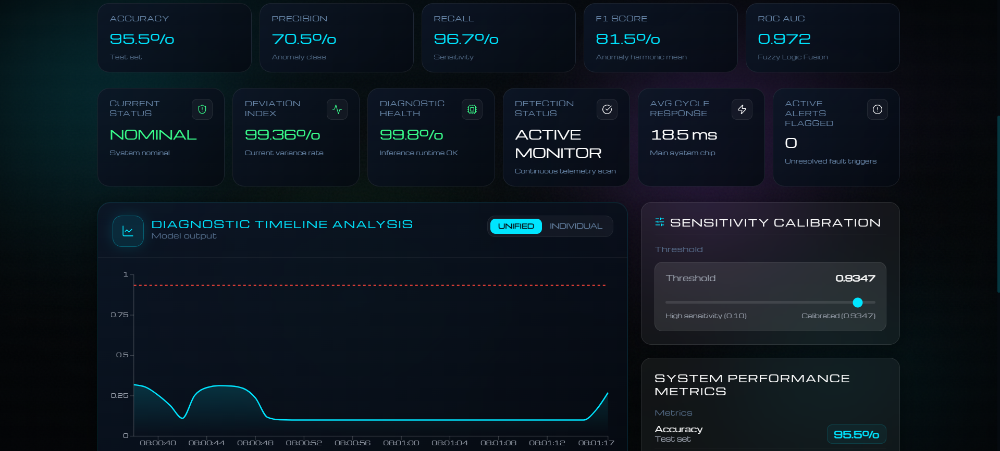
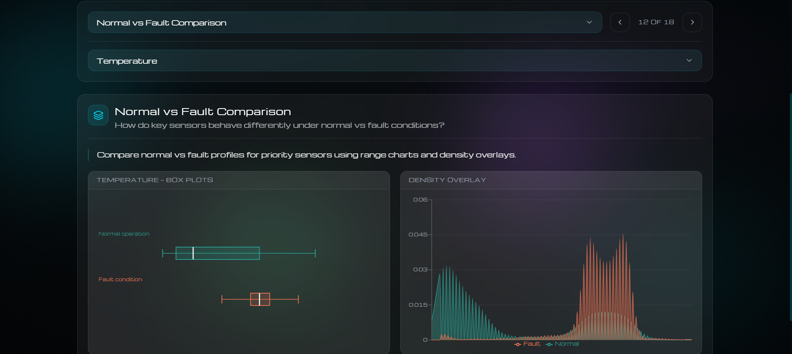

# AutoMech Fleet Health Monitor

> AI-powered predictive maintenance for fleet vehicles — Isolation Forest, LSTM AutoEncoder, and Fuzzy Logic Fusion with a live React dashboard and 3D digital twin.  
> **DEPI R4 · Microsoft ML Program · 2026**



---

## About the Project

Fleet operators lose time and money when vehicle faults go undetected until breakdown. **AutoMech** addresses this with an end-to-end AI system that ingests multivariate sensor telemetry, detects anomalies in real time, and presents actionable diagnostics through an interactive dashboard with a 3D digital twin.

### The Problem

The Vehicle Health Telemetry Dataset contains **604,802 rows** across **14 sensor channels**, but faults represent only **~2%** of observations. This extreme class imbalance creates an accuracy paradox: a model that always predicts "Normal" achieves **97.97% accuracy** while catching **zero faults**. Standard unsupervised detectors then flood operators with false alarms.

### Our Approach

We designed a **three-stage hybrid pipeline** where each model compensates for the others' weaknesses:

| Stage | Model | Strength | Weakness |
|-------|-------|----------|----------|
| 1 | **Isolation Forest** | Fast tabular outlier detection, 91% recall | Low precision (15.8%) |
| 2 | **LSTM AutoEncoder** | Temporal pattern learning, ROC-AUC 0.976 | Still high false positives |
| 3 | **Fuzzy Logic Fusion** | Interpretable risk score, **F1 = 81.5%** | Requires calibrated thresholds |

The fusion layer reduces false positives by **73%** compared to LSTM alone while maintaining **96.7% recall** — catching nearly every fault with far fewer false alarms.

### Key Results

| Model | Accuracy | Precision | Recall | F1 | ROC-AUC |
|-------|----------|-----------|--------|-----|---------|
| Isolation Forest | 90.0% | 15.8% | 91.3% | 26.9% | 0.929 |
| LSTM AutoEncoder | 84.7% | 39.7% | 97.8% | 56.4% | 0.976 |
| **Fuzzy Fusion** | **95.5%** | **70.5%** | **96.7%** | **81.5%** | **0.972** |

### What We Built

- **ML Pipeline** — 5 Jupyter notebooks from raw data to production artifacts
- **Inference Engine** — Python script scoring IF → LSTM → Fuzzy in one pass
- **Live Dashboard** — React app with SSE telemetry streaming, model metrics, and fleet EDA
- **3D Digital Twin** — Three.js vehicle model that reacts to anomaly alerts

> Arabic overview: [docs/project-overview-ar.md](docs/project-overview-ar.md)

<p align="center">
  
  
</p>

## Features

- **3-stage ML pipeline** — unsupervised + deep learning + fuzzy fusion
- **14 sensor channels** — engine, electrical, braking, motion, environment
- **Live dashboard** — telemetry streaming, anomaly alerts, 3D vehicle visualization
- **Predictive diagnostics** — threshold calibration, model performance metrics
- **Fleet analytics** — full EDA report with interactive charts

## Project Structure

```
AutoMech-Fleet-Health-Monitor/
├── docs/
├── data/
├── notebooks/
├── src/
├── artifacts/
└── dashboard/
```

## Dataset

The Vehicle Health Telemetry Dataset (~604k rows) is hosted on [Google Drive](https://drive.google.com/drive/folders/15IDy9Y7JEyd4dFFpE2fGYwHHwEV608Va?usp=drive_link). Download the files and place them locally:

| File | Path |
|------|------|
| `Vehicle-Health-Telemetry-Dataset.csv` | `data/raw/` |
| `Cleaned-Vehicle-Health-Telemetry-Dataset.csv` | `data/processed/` |

Processed CSVs are not tracked in git (`data/processed/*.csv` is gitignored). Sample telemetry under `data/samples/` remains in the repository for inference demos.

Training scripts and notebooks expect these local paths — download from Drive before running the ML pipeline or notebooks.

## ML Pipeline

```
Raw CSV → Preprocess → EDA
                ↓
    ┌───────────┴───────────┐
    ↓                       ↓
Isolation Forest      LSTM AutoEncoder
(56 tabular features) (10×14 sequences)
    └───────────┬───────────┘
                ↓
        Fuzzy Logic Fusion → Risk Score ≥ 0.9347
                ↓
         Dashboard + Inference API
```

| Stage | Notebook | Model | Role |
|-------|----------|-------|------|
| 0 | `01_data_preprocessing` | — | Clean & smooth raw telemetry |
| 1 | `02_vehicle_health_eda` | — | Exploratory analysis |
| 2 | `03_isolation_forest` | Isolation Forest | Unsupervised anomaly scoring |
| 3 | `04_lstm_autoencoder` | LSTM AutoEncoder | Sequence reconstruction errors |
| 4 | `05_fuzzy_logic_fusion` | Fuzzy Logic | Fuse IF + LSTM → final risk score |

**Production scripts:** `src/train/train_and_save_artifacts.py` · `src/inference/run_inference.py`

Full architecture diagrams: [docs/architecture.md](docs/architecture.md) · Tuning details: [docs/model-tuning-results.md](docs/model-tuning-results.md)

## Quick Start

```bash
git clone https://github.com/adelbadran/AutoMech-Fleet-Health-Monitor.git
cd AutoMech-Fleet-Health-Monitor

py -3.10 -m venv .venv
.venv\Scripts\activate

pip install -r requirements.txt
python src/train/train_and_save_artifacts.py
python src/scripts/generate_eda_summary.py
python src/scripts/generate_model_summary.py
python src/inference/run_inference.py data/samples/test_healthy.csv

cd dashboard
cp .env.example .env
npm install
npm run dev
```

- Dashboard: http://localhost:3000  
- API: http://localhost:5001

## Demo Data

| File | Expected result (default threshold) |
|------|-------------------------------------|
| `test_healthy.csv` | 0 anomalies |
| `test_fault.csv` | All rows flagged |
| `test_mixed.csv` | Partial anomalies |

## Tech Stack

| Layer | Technologies |
|-------|-------------|
| ML | Python, scikit-learn, PyTorch, pandas, scipy |
| Backend | Express.js, Python subprocess inference |
| Frontend | React, TypeScript, Vite, Three.js, Tailwind CSS |
| Data | Vehicle Health Telemetry Dataset (~604k rows) |

## Team

| Role | Members |
|------|---------|
| ML Engineering — Model Development | Adel Tamer · Marwan Mahmoud |
| ML Engineering — Preprocessing & Data Collection | Salah Khafaga · Shenouda Safwat |
| Dashboard / Full-stack | Jawad Tamer · Ekram Hatem |

## Documentation

- [Architecture & Pipeline Design](docs/architecture.md)
- [Model Fine-Tuning & Results](docs/model-tuning-results.md)
- [Project Overview (Arabic)](docs/project-overview-ar.md)
- [Model Card](docs/model-card.md)
- [Data](data/README.md)
- [Artifacts](artifacts/README.md)

## License

MIT License — see [LICENSE](LICENSE).

## Acknowledgments

DEPI R4 — Microsoft Machine Learning Graduation Project · 2026
