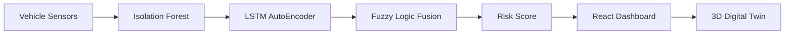
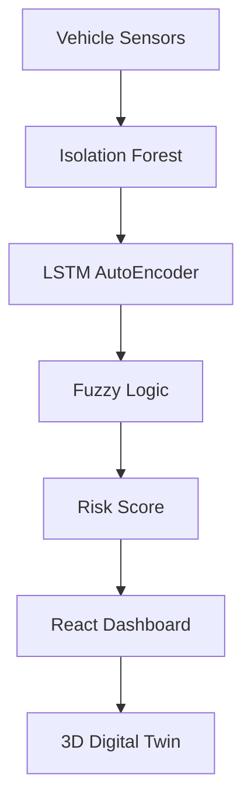

<div align="center">

  


<br><br>


<br><br>


</div>

---

# 🚀 Project Overview

> **AutoMech** is an intelligent predictive maintenance platform designed for modern fleet management.

Instead of waiting for vehicles to fail,
AutoMech continuously monitors **14 live telemetry sensors**, detects abnormal behavior using multiple AI models, and presents everything through an interactive **React Dashboard** with a **3D Digital Twin**.

---

# 🎯 The Challenge

<div align="center">

| 📊 Dataset Size | 🚗 Sensor Channels | ⚠ Fault Ratio |
|:---------------:|:-----------------:|:-------------:|
| **604,802 Rows** | **14 Sensors** | **≈2%** |

</div>

Because only **2%** of samples are faulty...

```text
███████████████████████████████████████░░

Normal Vehicles   ▓▓▓▓▓▓▓▓▓▓▓▓▓▓▓▓▓▓▓▓▓▓▓ 97.97%

Faulty Vehicles   ▓ 2.03%
```

Traditional ML models simply predict **Normal**...

✅ 97.97% Accuracy

❌ Detects ZERO failures.

This is known as the **Accuracy Paradox**.

---

# 🧠 Our AI Pipeline



---

# ⚙ Hybrid Intelligence

<div align="center">

| Stage | AI Model | Purpose |
|:----:|:---------|:--------|
| ① | 🌲 Isolation Forest | Fast anomaly screening |
| ② | 🧠 LSTM AutoEncoder | Learn temporal behavior |
| ③ | 🎯 Fuzzy Logic | Intelligent risk fusion |

</div>

Each stage fixes the weakness of the previous one.

Instead of relying on one AI model,

AutoMech combines **Machine Learning + Deep Learning + Expert Knowledge** into one prediction.

---
# 📈 Performance Comparison

<div align="center">

| 🌲 Isolation Forest | 🧠 LSTM AutoEncoder | 🏆 Fuzzy Fusion |
|:------------------:|:------------------:|:---------------:|
| **Accuracy**<br>🟩🟩🟩🟩🟩🟩🟩🟩🟩⬜ **90.0%** | **Accuracy**<br>🟩🟩🟩🟩🟩🟩🟩🟩⬜⬜ **84.7%** | **Accuracy**<br>🟩🟩🟩🟩🟩🟩🟩🟩🟩🟩 **95.5%** |
| **Precision**<br>🟨⬜⬜⬜⬜⬜⬜⬜⬜⬜ **15.8%** | **Precision**<br>🟨🟨🟨🟨⬜⬜⬜⬜⬜⬜ **39.7%** | **Precision**<br>🟨🟨🟨🟨🟨🟨🟨⬜⬜⬜ **70.5%** |
| **Recall**<br>🟦🟦🟦🟦🟦🟦🟦🟦🟦⬜ **91.3%** | **Recall**<br>🟦🟦🟦🟦🟦🟦🟦🟦🟦🟦 **97.8%** | **Recall**<br>🟦🟦🟦🟦🟦🟦🟦🟦🟦🟦 **96.7%** |
| **F1 Score**<br>🟥🟥🟥⬜⬜⬜⬜⬜⬜⬜ **26.9%** | **F1 Score**<br>🟥🟥🟥🟥🟥🟥⬜⬜⬜⬜ **56.4%** | **F1 Score**<br>🟥🟥🟥🟥🟥🟥🟥🟥⬜⬜ **81.5%** |
| **ROC-AUC**<br>⭐⭐⭐⭐⭐☆☆☆☆☆ **0.929** | **ROC-AUC**<br>⭐⭐⭐⭐⭐⭐⭐⭐⭐⭐ **0.976** | **ROC-AUC**<br>⭐⭐⭐⭐⭐⭐⭐⭐⭐⭐ **0.972** |

</div>

---

<div align="center">

## 🏅 Overall Winner

| 🥇 Best Model |
|:-------------:|
| 🏆 **Fuzzy Logic Fusion** |
| ✅ Highest F1 Score |
| ✅ Highest Precision |
| ✅ 96.7% Recall |
| ✅ 73% Fewer False Positives |

</div>

---

# 🏆 Final Improvement

<div align="center">

| 📉 False Positives | ❤️ Recall | ⭐ Final F1 |
|:------------------:|:---------:|:-----------:|
| **↓ 73%** | **96.7%** | **81.5%** |

</div>

```
False Positives

LSTM Alone

█████████████████████████████

Fuzzy Fusion

███████
```

---
# ✨ What We Built

<div align="center">

<table>
<tr>

<td width="25%" align="center" valign="top">


<h3>📚 ML Pipeline</h3>

<b>End-to-End AI Workflow</b>

<br>

🧹 Data Cleaning<br>
📊 Feature Engineering<br>
🤖 Model Training<br>
📈 Model Evaluation<br>
🚀 Model Export

</td>

<td width="25%" align="center" valign="top">


<h3>⚡ Inference Engine</h3>

<b>Hybrid AI Decision Pipeline</b>

<br>

🌲 Isolation Forest<br>
⬇️<br>
🧠 LSTM AutoEncoder<br>
⬇️<br>
🎯 Fuzzy Logic Fusion

</td>

<td width="25%" align="center" valign="top">


<h3>📡 Live Dashboard</h3>

<b>Real-Time Monitoring</b>

<br>

📊 Live Charts<br>
📡 Telemetry Streaming<br>
🚨 Instant Alerts<br>
🚗 Fleet Overview

</td>

<td width="25%" align="center" valign="top">


<h3>🚗 3D Digital Twin</h3>

<b>Interactive Three.js Vehicle</b>

<br>

⚙️ Engine Status<br>
🛞 Wheel Animation<br>
🔋 Battery Health<br>
🌡️ Sensor Visualization

</td>

</tr>

<tr>

<td colspan="4" align="center">

<br>


<h3>📊 Fleet Analytics</h3>

<b>Comprehensive Data Insights</b>

<br>

📈 Feature Distribution • 📉 Correlation Matrix • 🔥 Heatmaps • 📊 Sensor Analysis • 🧠 AI Insights

</td>

</tr>

</table>

</div>
<details>
<summary>📊 Dashboard Preview</summary>


</details>

<details>
<summary>📈 Fleet Analytics</summary>


</details>

---

# 🤖 AutoMech AI Platform

<div >

| 🚗 Predict | 📡 Stream | 🌲 Detect | 🧠 Learn |
|:---------:|:---------:|:---------:|:--------:|
| Predictive Maintenance | Live Telemetry | Isolation Forest | LSTM AutoEncoder |

| 🎯 Decide | 📊 Analyze | 🚨 Alert | 🌍 Visualize |
|:---------:|:----------:|:--------:|:------------:|
| Fuzzy Logic Fusion | Fleet Analytics | Real-Time Alerts | 3D Digital Twin |

</div>

---

# 📂 Project Structure

<div align="center">

| 📁 Folder | 📄 Description |
|:---------:|----------------|
| 📂 **docs** | Project documentation, figures, and README assets |
| 📂 **data** | Raw, processed, and sample telemetry datasets |
| 📂 **notebooks** | End-to-end ML pipeline and experimentation |
| 📂 **src** | Core source code, inference engine, and utilities |
| 📂 **artifacts** | Trained models, scalers, and serialized assets |
| 📂 **dashboard** | React dashboard with live monitoring and 3D visualization |

</div>

<details>

<summary><b>📁 Directory Tree</b></summary>

```text
AutoMech-Fleet-Health-Monitor/
│
├── 📂 docs/
├── 📂 data/
│   ├── raw/
│   ├── processed/
│   └── samples/
│
├── 📂 notebooks/
├── 📂 src/
├── 📂 artifacts/
└── 📂 dashboard/
```

</details>

---

# 💾 Dataset

<div align="center">

| 📄 Dataset | 📂 Location | 📊 Purpose |
|:-----------|:-----------:|-----------:|
| 🚗 Vehicle-Health-Telemetry-Dataset.csv | `data/raw/` | Original telemetry dataset |
| 🧹 Cleaned-Vehicle-Health-Telemetry-Dataset.csv | `data/processed/` | Preprocessed dataset for training |

</div>

> ⚠️ **Note:** Processed datasets are excluded from Git using `.gitignore`.

> 📦 Sample telemetry files are included in `data/samples/` for inference demonstrations.

---

<div align="center">

### 🌍 AutoMech Architecture



</div>

---

<div align="center">

## ⭐ AI for Smarter Fleets

### Detect Early • Predict Faster • Reduce Downtime

🚗⚡🧠

</div>

# 🚀 Quick Start

## 1️⃣ Clone the Repository

```bash
git clone https://github.com/adelbadran/AutoMech-Fleet-Health-Monitor.git
cd AutoMech-Fleet-Health-Monitor
```

---

## 2️⃣ Create Virtual Environment

```bash
py -3.10 -m venv .venv
.venv\Scripts\activate
```

---

## 3️⃣ Install Dependencies

```bash
pip install -r requirements.txt
```

---

## 4️⃣ Train Models

```bash
python src/train/train_and_save_artifacts.py
```

---

## 5️⃣ Generate Reports

```bash
python src/scripts/generate_eda_summary.py
python src/scripts/generate_model_summary.py
```

---

## 6️⃣ Run Inference

```bash
python src/inference/run_inference.py data/samples/test_healthy.csv
```

---

## 7️⃣ Start Dashboard

```bash
cd dashboard
cp .env.example .env

npm install
npm run dev
```

<div align="center">

| 🌐 Service | 🔗 URL |
|:----------:|:-------|
| 📊 Dashboard | http://localhost:3000 |
| ⚙️ API | http://localhost:5001 |

</div>

---

# 🧪 Demo Dataset

<div align="center">

| 📄 Sample | ✅ Expected Result |
|:----------|:------------------|
| 🟢 `test_healthy.csv` | 0 anomalies detected |
| 🔴 `test_fault.csv` | All records flagged as anomalies |
| 🟡 `test_mixed.csv` | Partial anomaly detection |

</div>

---

# 🛠️ Tech Stack

### 🤖 Machine Learning — Model Development


---

### ⚙️ Backend


---

### 💻 Frontend


---

### 📊 Dataset
 
> **Note:** Contains approximately **~604K Records** for comprehensive health monitoring.

---

<h2 style="font-size: 28px; font-weight: bold; background: linear-gradient(45deg, #434C50, #B2E6C0); -webkit-background-clip: text; -webkit-text-fill-color: transparent;">👥 Team</h2>
<div align="center">
  <table style="border-collapse: collapse; border: none;">
    <tr>
      <td colspan="3" align="center" style="border: none; padding-bottom: 20px;">
        <h2 style="font-size: 28px; font-weight: bold; background: linear-gradient(45deg, #434C50, #B2E6C0); -webkit-background-clip: text; -webkit-text-fill-color: transparent;"></h2>
      </td>
    </tr>
    <tr style="border: none;">
      <td width="30%" valign="top" style="border: none; padding: 10px;">
        <div style="background: #1a1c1e; border: 2px solid #434C50; border-radius: 12px; padding: 20px; box-shadow: 0 0 15px rgba(178, 230, 192, 0.2); animation: pulse 2s infinite alternate;">
          <h3 style="color: #B2E6C0; margin-top: 0;">🤖 ML Engineering</h3>
          <p style="color: #8a9095; font-size: 12px; font-style: italic;">Model Development</p>
          <hr style="border-color: #333; margin: 10px 0;">
          <p style="font-weight: 600; color: #fff; line-height: 1.6;">👨‍💻 Adel Tamer<br>👨‍💻 Marwan Mahmoud</p>
        </div>
      </td>
      <td width="30%" valign="top" style="border: none; padding: 10px;">
        <div style="background: #1a1c1e; border: 2px solid #434C50; border-radius: 12px; padding: 20px; box-shadow: 0 0 15px rgba(255, 114, 94, 0.2); animation: pulse 2s infinite alternate; animation-delay: 0.6s;">
          <h3 style="color: #FF725E; margin-top: 0;">📊 ML Engineering</h3>
          <p style="color: #8a9095; font-size: 12px; font-style: italic;">Data & Preprocessing</p>
          <hr style="border-color: #333; margin: 10px 0;">
          <p style="font-weight: 600; color: #fff; line-height: 1.6;">👨‍💻 Shenouda Safwat<br>👨‍💻 Salah Khafaga</p>
        </div>
      </td>
      <td width="30%" valign="top" style="border: none; padding: 10px;">
        <div style="background: #1a1c1e; border: 2px solid #434C50; border-radius: 12px; padding: 20px; box-shadow: 0 0 15px rgba(178, 230, 192, 0.2); animation: pulse 2s infinite alternate; animation-delay: 1.2s;">
          <h3 style="color: #B2E6C0; margin-top: 0;">🌐 Full-Stack</h3>
          <p style="color: #8a9095; font-size: 11px; font-style: italic;">Dashboard Development</p>
          <hr style="border-color: #333; margin: 10px 0;">
          <p style="font-weight: 600; color: #fff; line-height: 1.6;">👨‍💻 Jawad Tamer<br>👨‍💻 Ekram Hatem</p>
        </div>
      </td>
    </tr>
  </table>
</div>

---

# 📚 Documentation

| 📂 Section | 🛠️ Visual Badge |
|:---|:---|
| 📐 **Architecture & Pipeline Design** |  |
| 🧠 **Model Fine-Tuning & Evaluation** |  |
| 🇪🇬 **Project Overview (Arabic)** |  |
| 📄 **Model Card** |  |
| 📂 **Dataset** |  |
| 🤖 **Trained Artifacts** |  |


---

# 📜 License

This project is licensed under the **MIT License**.

See the **LICENSE** file for details.

---

# 🙏 Acknowledgments

<div align="center">

### 🎓 DEPI R4 — Microsoft Machine Learning Graduation Project

**2026**

</div>


