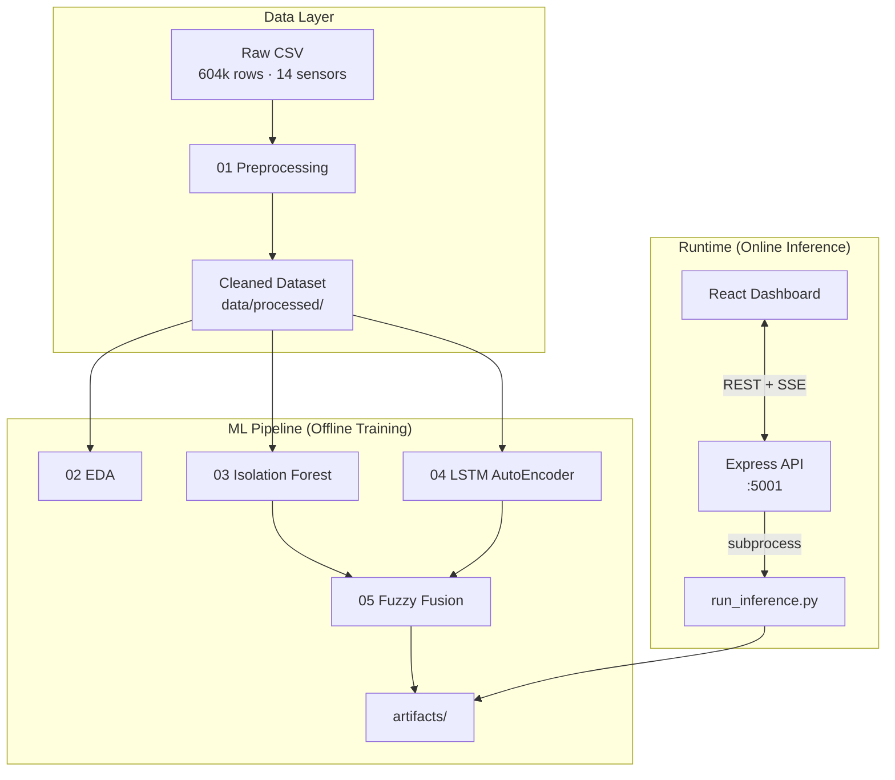
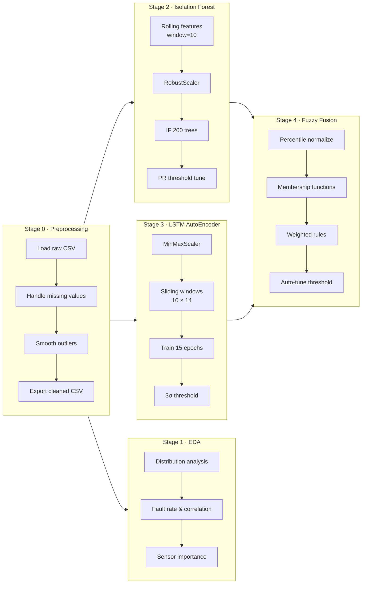
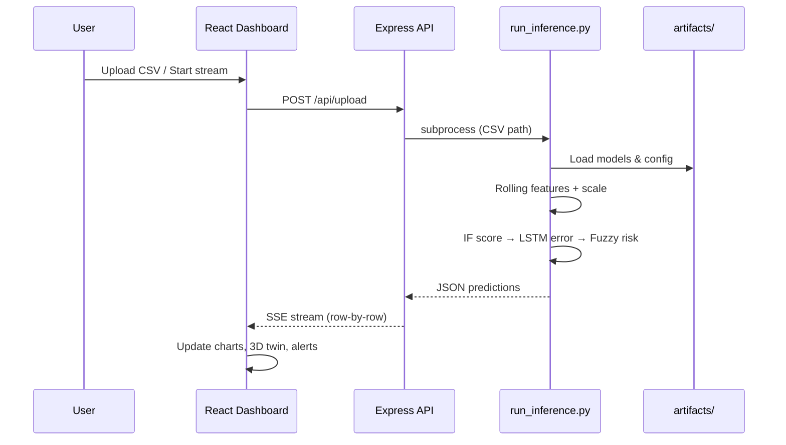

# Pipeline Architecture Design

## 1. System Overview

AutoMech is a three-tier system: **data & ML pipeline** (Python), **inference API** (Python subprocess), and **live dashboard** (React + Express).



---

## 2. End-to-End Deployment Architecture

```
┌──────────────────────────────────────────────────────────────────────────┐
│                    AutoMech Dashboard (React + Vite)                      │
│  ┌─────────────┐  ┌──────────────────┐  ┌────────────────────────────┐ │
│  │ Live Monitor│  │ AI Diagnostics   │  │ Fleet Analytics (EDA)        │ │
│  │ 3D Twin     │  │ Model Metrics    │  │ Interactive Charts         │ │
│  └─────────────┘  └──────────────────┘  └────────────────────────────┘ │
└───────────────────────────────┬──────────────────────────────────────────┘
                                │  REST  /api/*  ·  SSE  /api/stream
┌───────────────────────────────▼──────────────────────────────────────────┐
│                     Express.js Backend (dashboard/server.ts)              │
│  /api/health  ·  /api/eda  ·  /api/models  ·  /api/upload  ·  /api/stream│
└───────────────────────────────┬──────────────────────────────────────────┘
                                │  python src/inference/run_inference.py
┌───────────────────────────────▼──────────────────────────────────────────┐
│                         Python Inference Engine                           │
│  Rolling Features → IF Score → LSTM Error → Fuzzy Risk → Subsystem Tag   │
└───────────────────────────────┬──────────────────────────────────────────┘
                                │
┌───────────────────────────────▼──────────────────────────────────────────┐
│                            artifacts/                                     │
│  isolation_forest_model.pkl  ·  LSTM_autoencoder_model.pth               │
│  robust_scaler.pkl  ·  min_max_scaler.pkl  ·  fuzzy_model_config.json    │
└──────────────────────────────────────────────────────────────────────────┘
```

---

## 3. ML Pipeline — Stage by Stage



---

## 4. Feature Engineering

### Isolation Forest Path (Tabular)

| Transform | Per Sensor | Total Features |
|-----------|-----------|----------------|
| Raw value | 14 | 14 |
| Rolling mean (w=10) | 14 | 14 |
| Rolling std (w=10) | 14 | 14 |
| First difference | 14 | 14 |
| **Total** | | **56** |

- Scaler: `RobustScaler` (median/IQR based)
- Split: 60% train · 20% validation · 20% test (stratified)

### LSTM AutoEncoder Path (Sequential)

| Property | Value |
|----------|-------|
| Input shape | `(batch, 10, 14)` |
| Scaler | `MinMaxScaler` fit on first 80% chronologically |
| No manual feature engineering | Raw scaled sensors only |

---

## 5. Model Architecture Detail

### Isolation Forest

```
56 features → RobustScaler → IsolationForest(n=200, contamination=2.03%)
                                    ↓
                          anomaly score (higher = more anomalous)
                                    ↓
                    threshold = −0.2137 (PR-curve optimized)
```

### LSTM AutoEncoder

```
(10, 14) ──► LSTM(64) ──► LSTM(16) ──► latent
                ▲                           │
                └──── LSTM(16) ◄── LSTM(64) ◄┘
                              │
                         Linear(14)
                              ↓
                    reconstruction error (MAE)
                              ↓
              threshold = mean(train_errors) + 3σ = 0.01156
```

### Fuzzy Logic Fusion

```
IF score ──► percentile scale [0,1] ──► membership (low/med/high) ──┐
                                                                       ├──► weighted Sugeno rules ──► risk score [0,1]
LSTM error ► percentile scale [0,1] ──► membership (low/med/high) ──┘
                                              ↓
                              final_prediction = risk ≥ 0.9347
```

**Key fusion parameters**

| Parameter | Value |
|-----------|-------|
| LSTM weight in rules | 3.5× |
| Membership low breakpoint | 0.20 |
| Membership high breakpoint | 0.75 |
| IF calibration percentiles | P1–P99 |
| LSTM calibration percentiles | P1–P99 |
| Decision threshold | 0.9347 |

---

## 6. Inference Data Flow



### Per-Row Inference Steps

1. **Buffer** last 10 rows for rolling features and LSTM sequence
2. **Scale** with persisted `RobustScaler` / `MinMaxScaler`
3. **Score** with Isolation Forest → raw IF anomaly score
4. **Reconstruct** with LSTM → MAE reconstruction error
5. **Normalize** both scores using fuzzy config percentiles
6. **Fuse** via fuzzy rules → `final_risk_score`
7. **Classify** anomaly if score ≥ 0.9347
8. **Diagnose** subsystem via heuristic sensor bounds (Engine, Battery, Brakes, Suspension, Oil)

---

## 7. Repository Layout

| Folder | Purpose |
|--------|---------|
| `data/raw/` | Original telemetry CSV (from Google Drive) |
| `data/processed/` | Cleaned dataset (gitignored) |
| `data/samples/` | Demo CSVs for inference testing |
| `notebooks/` | Reproducible research — one notebook per pipeline stage |
| `src/train/` | Export production-ready artifacts |
| `src/inference/` | Single entry point for scoring |
| `src/scripts/` | Offline JSON generators (EDA, model summary) |
| `artifacts/` | Trained models, scalers, fuzzy config, metrics JSON |
| `dashboard/` | Self-contained React + Express web app |
| `docs/` | Architecture, model card, tuning results |

---

## 8. Design Decisions

| Decision | Why |
|----------|-----|
| **Hybrid ensemble** (IF + LSTM + Fuzzy) | IF catches statistical outliers; LSTM catches temporal drift; fuzzy reduces disagreement false positives |
| **Unsupervised base models** | Fault labels are sparse; models learn "normal" behavior rather than memorizing fault types |
| **PR-curve thresholds** | Accuracy is misleading on 98% normal data; F1 on anomaly class drives tuning |
| **Chronological LSTM split** | Prevents temporal leakage in sequence model |
| **Stratified IF split** | Ensures enough anomaly samples in test set for reliable evaluation |
| **Python subprocess inference** | Keeps ML stack in Python while dashboard stays Node/React |
| **SSE streaming** | Simulates live telemetry playback for demo UX |

---

## Related Docs

- [Model Fine-Tuning & Results](model-tuning-results.md)
- [Model Card](model-card.md)
